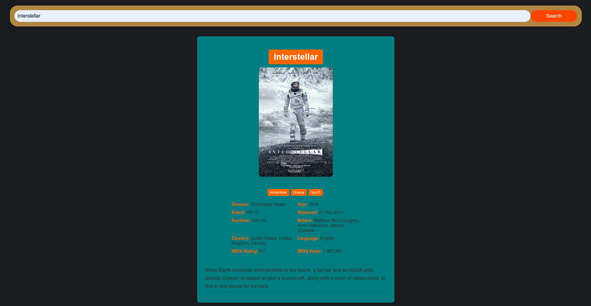

# Project Proposal: Personalized Movie and Music Recommendation Platform

## Introduction

Welcome to my exciting project aimed at transforming the way users discover and enjoy entertainment content. My project focuses on creating a user-friendly platform that offers personalized movie and music recommendations. The frontend is being developed using ReactJS framework.

## Project Overview

The main goal of our project is to provide users with tailored movie and music suggestions, enhancing their entertainment experience. We are currently building a feature that offers movie recommendations based on user input. In the future, we plan to expand the platform by generating related movie suggestions based on the user's initial choice, creating a journey through a curated selection of similar movies.

## Expansion and Future Features

As part of the roadmap, I'm excited to integrate music recommendations into the platform, broadening its scope and enriching user engagement. My future plans include:

- **Backend Infrastructure:** Establishing a robust backend infrastructure to support the project's growing complexity and facilitate seamless data management.
- **User Authentication:** Implementing user authentication functionality to allow users to create accounts, unlocking a more personalized experience.
- **Refined Recommendations:** Collecting user preferences through targeted questions to fine-tune movie and music recommendations, providing a truly customized content selection.

## Collaborator Opportunity

To achieve these ambitious goals, we are seeking talented and passionate individuals to collaborate with us. Specifically, I'm are looking for:

- **UI/UX Developer:** A creative and skilled UI/UX developer who can enhance the user interface and design elements of the platform. Your expertise will ensure an intuitive and visually appealing user experience.

- **Backend Developer:** An experienced backend developer who can architect the backend infrastructure, manage data flow, and enable interactions between the frontend and backend components.

## Benefits of Collaboration

Collaborators on this project will enjoy:

- **Innovation:** The chance to be part of a pioneering project that redefines how users discover entertainment content.
- **Skill Growth:** Opportunities to expand skills and knowledge in UI/UX design, backend development, and integrated systems.
- **Recognition:** Credit for your contributions and involvement in a groundbreaking platform.
- **Portfolio Enhancement:** Showcase your work on a project with real-world impact.
- **Team Experience:** Collaborate with a diverse team of motivated individuals, fostering learning and growth.

## How to Join

If you're enthusiastic about shaping the future of entertainment discovery and possess the skills we're seeking, we invite you to join us. To express your interest, please contact us at [https://www.linkedin.com/in/hawkazizi/] or [hawk.azizi1@gmail.com]. Feel free to share your portfolio or relevant experience.

## Conclusion

In conclusion, My project seeks to create a revolutionary entertainment recommendation platform, offering users personalized movie and music suggestions. I'm  excited to collaborate with talented UI/UX and backend developers who share our vision.

Best regards,
Shahin Azizi
[hawk.azizi1@gmail.com]

<!-- Placeholder for Images and Previews -->
##Preview of MovieWhiz

